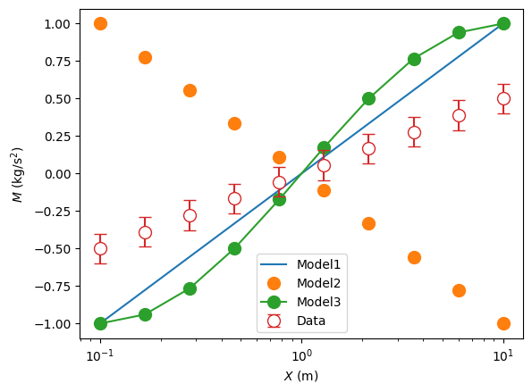
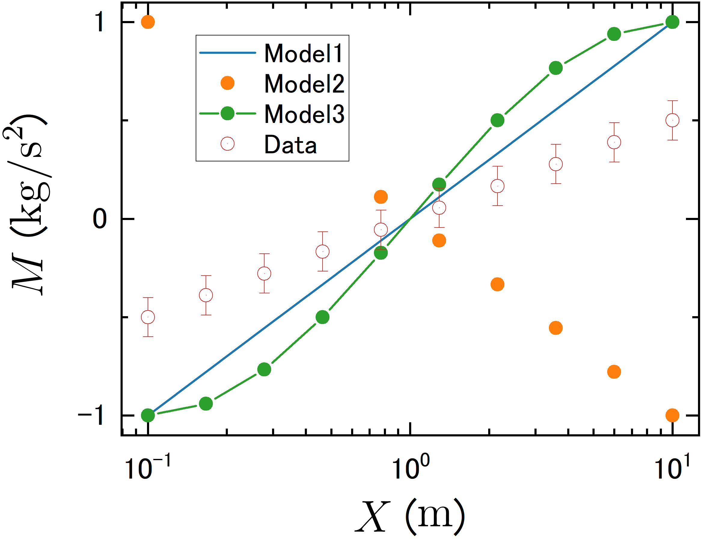

# python_to_originlab
## Overview
Functions in python to automate sending data and basic plotting functions in OriginLab. The function matplotlib_to_origin can convert matplotlib figures directly to origin graphs.

Fork from [jsbangsund/python_to_originlab](https://github.com/jsbangsund/python_to_originlab)

main updates

* Use originpro instead of OriginEXT
* Support astropy.units.Quantity
* Support matplotlib.pyplot.errobar (only yerr)

remaing tasks

* font size of x and y axis label
* font size of ledgend
* Support matplotlib.pyplot.errobar (xerr)

## Sample Code
```
import matplotlib.pyplot as plt
from py2origin import matplotlib_to_origin
from astropy_extension.visualization import labeled_quantity_support
import astropy.units as u
import numpy as np

fig, ax = plt.subplots()

with labeled_quantity_support("$X$","$M$"):
    xraw = np.linspace(-1,1, 10)
    x = 10**xraw * u.m

    y = xraw * u.kg / u.s**2
    ax.plot(x, y, label="Model1")

    y = -xraw * 1e3 * u.g / u.s**2
    ax.plot(x, y, "o", markersize=10, label="Model2")

    y = np.sin(np.pi * xraw / 2) * u.kg / u.s**2
    ax.plot(x.to(u.mm), y, "o-", markersize=10, label="Model3")

    y = 0.5 * xraw * u.kg / u.s**2
    yerr = np.array([0.1] * len(y)) * u.kg / u.s**2
    ax.errorbar(x, y, fmt="o", markersize=10, capsize=5, yerr=yerr, label="Data", mfc="w")

    plt.xscale("log")
plt.legend()

op = matplotlib_to_origin(
    fig,
    ax,
    folder_name="Folder",
    worksheet_name="Sheet",
    workbook_name=f"Book",
    graph_name=f"Graph"
)
```

figure in python



graph in origin



# python_to_originlab (original documentaions)
The function matplotlib_to_origin will try it's best to convert a matplotlib figure to an origin graph, extracting data and line properties from the figure and axis handles. It's by no means perfect, but allows for data to quickly be transferred from the python environment to OriginLab for further tweaking and sharing (with, e.g., advisors who demand you use Origin).


## Dependencies
OriginLab must be installed, and must have the win32com python package (https://anaconda.org/anaconda/pywin32).
[OriginExt](https://pypi.org/project/OriginExt/#description) is also used, and can be installed with:
`pip install originext`

## Other notes
Origin color increment lists (.oth files) follow the color series in https://jiffyclub.github.io/palettable/, and can be found in the folder "\OriginTemplates\Themes\Graph".

There are a number of small syntax differences between versions. I have tested this code on OriginLab 2016 and 2018, but don't know about compatibility outside of those versions.

OriginLab's default directory for user templates is (with appropriate version year selected):
C:\Users\username\Documents\OriginLab\2016\User Files

## Documentation
OriginLab has fairly spotty documentation, but the two main documentation sources are for the Automation Server, and for LabTalk commands. LabTalk seems to be a much older and more thoroughly developed/documented language, so more complicated and specific commands can be achieved with this.

- [Automation Server Docs](https://www.originlab.com/doc/COM/Classes/ApplicationSI)
- [LabTalk Docs](https://www.originlab.com/doc/LabTalk/guide)


## Other Resources
- https://github.com/swharden/PyOriginTools
- [OriginExt Package](https://pypi.org/project/OriginExt/)
